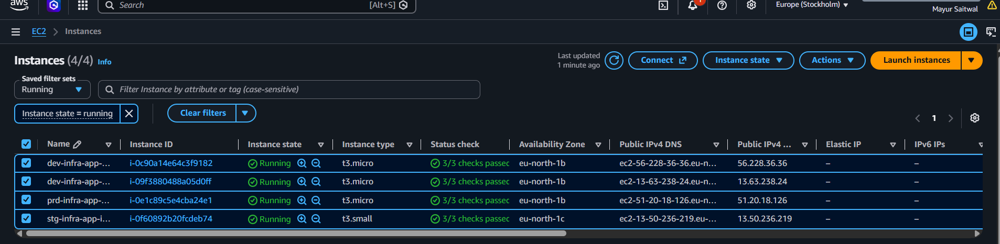
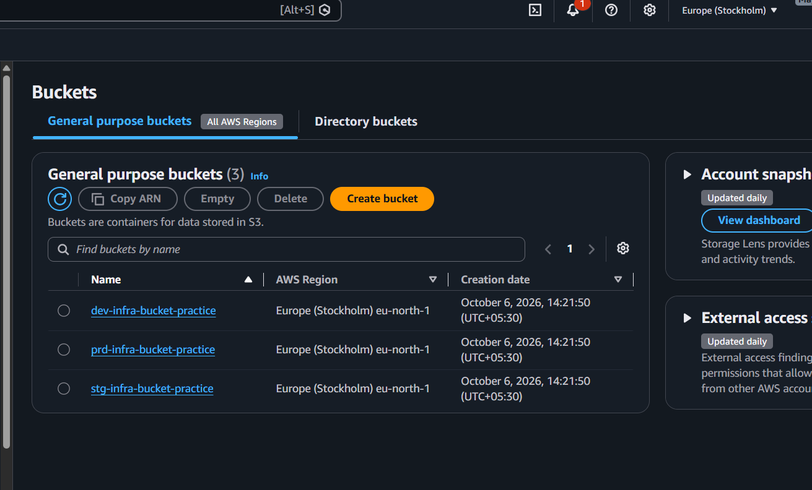
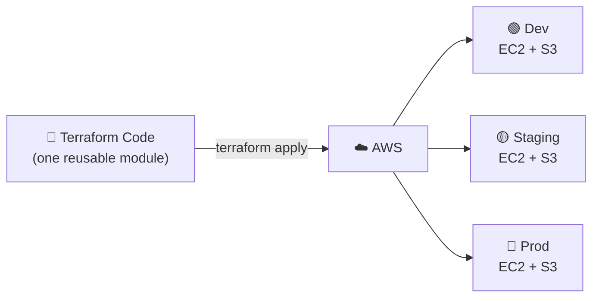

<div align="center">

# 🏗️ Multi-Environment AWS Infrastructure with Terraform

### Dev · Staging · Prod — EC2 and S3 provisioned from one reusable module, with zero manual console work

<br>


<br>

[Screenshots](#-project-screenshots) •
[About](#-about-the-project) •
[Architecture](#-architecture) •
[Tech Stack](#-tech-stack) •
[Getting Started](#-getting-started) •
[Learnings](#-challenges--learnings)

</div>

---

## 📸 Project Screenshots


<table>
  <tr>
    <td align="center" width="50%">
      <br>
      <b>EC2 Instances (dev, staging, prod)</b>
    </td>
    <td align="center" width="50%">
      <br>
      <b>S3 Buckets per Environment</b>
    </td>
  </tr>
  <tr>
    <td align="center" width="50%">
      <br>
      <b>Execution Plan Preview</b>
    </td>
    <td align="center" width="50%">
      <br>
      <b>Outputs (Public IPs and Bucket Names)</b>
    </td>
  </tr>
  <tr>
    <td align="center" width="50%">
      <br>
      <b>SSH Access with the Generated Key Pair</b>
    </td>
    <td align="center" width="50%">
      <br>
      <b>Clean Teardown with <code>terraform destroy</code></b>
    </td>
  </tr>
</table>

---

## 📖 About The Project

Creating the same servers and storage by hand in the AWS Console for every environment is **slow, repetitive and easy to get wrong**.

This project replaces that manual work with **Infrastructure as Code**. A single **reusable Terraform module** (`infra-app`) defines an **EC2 instance** and an **S3 bucket**. The module is then called once for each environment (**dev, staging, prod**) with different **variables**, and **outputs** print the values you need after deployment.

### ✨ Highlights

| | Feature |
|---|---|
| ♻️ | One reusable **module** shared by every environment |
| 🌍 | **Multi-environment** setup from a single codebase |
| ⚙️ | Configurable through **variables** (instance type, AMI, bucket name, environment) |
| 📤 | **Outputs** for public IPs and bucket names |
| 🔑 | **SSH key pair** for secure EC2 access |
| 🔒 | Secrets, state files and keys excluded with a strict `.gitignore` |
| 🧹 | Full cleanup with one command: `terraform destroy` |

### ⚖️ Manual vs Terraform

| ❌ Manual (AWS Console) | ✅ With Terraform |
|:---|:---|
| Click through many screens per environment | Run `terraform apply` |
| Easy to miss a setting | Identical result every time |
| Hard to repeat for a new environment | Add one module block |
| No record of what changed | Everything versioned in Git |

---

## 🏗️ Architecture



> **In one line:** write the infrastructure once, run one command, and get identical Dev, Staging and Prod environments on AWS.

<details>
<summary><b>📋 How it works (click to expand)</b></summary>

<br>

| Step | What happens |
|------|--------------|
| 1️⃣ | `main.tf` calls the `infra-app` module once per environment |
| 2️⃣ | Each call passes its own variable values (name, size, bucket) |
| 3️⃣ | The module creates an EC2 instance and an S3 bucket using those values |
| 4️⃣ | `outputs.tf` prints the public IPs and bucket names |
| 5️⃣ | Terraform records everything in the state file so it can update or destroy it later |

</details>

---

## 🧰 Tech Stack

| Layer | Tools |
|-------|-------|
| **Infrastructure as Code** | Terraform |
| **Cloud Provider** | AWS |
| **Compute** | Amazon EC2 |
| **Storage** | Amazon S3 |
| **Access** | SSH key pair |
| **Version Control** | Git and GitHub |

---

## 📂 Project Structure

```bash
DEVOPS-PROJECT-2/
├── 🙈 .gitignore
├── 🖼️ docs/
│   └── screenshots/
└── 🏗️ Terraform/
    ├── ♻️ infra-app/              # Reusable module (EC2 + S3)
    │   ├── main.tf
    │   ├── variables.tf
    │   └── outputs.tf
    ├── 📤 outputs/
    ├── 📜 main.tf                 # Calls the module for each environment
    ├── ☁️ provider.tf             # AWS provider configuration
    ├── 📌 terraform.tf            # Terraform and provider version constraints
    ├── 📤 outputs.tf              # Root outputs
    ├── 🔐 .terraform.lock.hcl     # Provider version lock
    └── 📘 README.md
```

> 💡 Adjust file names to match your repository.

---

## ✅ Prerequisites

| Tool | Purpose |
|------|---------|
| 🏗️ **Terraform** `>= 1.0` | Provision the infrastructure |
| 🔑 **AWS CLI** | Authenticate with AWS |
| 🔐 **ssh-keygen** | Generate the EC2 key pair |

An AWS account with permissions for **EC2 and S3** is also required.

```bash
aws configure
```

---

## 🚀 Getting Started

### 🔹 Step 1 · Clone the Repository

```bash
git clone https://github.com/<your-username>/<repo-name>.git
cd <repo-name>/Terraform
```

---

### 🔹 Step 2 · Generate the SSH Key Pair

```bash
ssh-keygen -t rsa -b 4096 -f terra-key-ec2
```

> 🔒 **Never commit the private key.** `terra-key-ec2`, `terra-key-ec2.pub`, `*.pem` and `*.key` are all listed in `.gitignore`.

---

### 🔹 Step 3 · Understand the Module Call

Each environment is just a module block with different inputs:

<details>
<summary><b>📄 Example <code>main.tf</code></b></summary>

```hcl
module "dev" {
  source        = "./infra-app"
  env           = "dev"
  instance_type = "t2.micro"
  bucket_name   = "myapp-dev-bucket"
}

module "staging" {
  source        = "./infra-app"
  env           = "staging"
  instance_type = "t2.small"
  bucket_name   = "myapp-staging-bucket"
}

module "prod" {
  source        = "./infra-app"
  env           = "prod"
  instance_type = "t3.medium"
  bucket_name   = "myapp-prod-bucket"
}
```

> ✏️ Replace with the real contents of your `main.tf`.

</details>

<details>
<summary><b>📌 Input Variables</b></summary>

<br>

| Variable | Description | Example |
|----------|-------------|---------|
| `env` | Environment name | `dev` |
| `instance_type` | EC2 instance size | `t2.micro` |
| `ami_id` | AMI used for the instance | `ami-0abcd1234` |
| `bucket_name` | S3 bucket name (globally unique) | `myapp-dev-bucket` |

> ✏️ Update to match your `variables.tf`.

</details>

---

### 🔹 Step 4 · Initialise Terraform

Downloads the AWS provider and prepares the working directory.

```bash
terraform init
```

---

### 🔹 Step 5 · Format, Validate and Plan

```bash
terraform fmt
terraform validate
terraform plan
```

Review what Terraform is about to create before anything is changed.

<!-- 📸 Add screenshot: docs/screenshots/terraform-plan.png -->

---

### 🔹 Step 6 · Apply

```bash
terraform apply
```

Type `yes` to confirm. All environments are created in a few minutes. 🎉

<!-- 📸 Add screenshot: docs/screenshots/terraform-apply.png -->

---

### 🔹 Step 7 · Read the Outputs and Connect

```bash
terraform output
```

| Output | Description |
|--------|-------------|
| `ec2_public_ip` | Public IP of each EC2 instance |
| `s3_bucket_name` | Name of each S3 bucket |

```bash
ssh -i terra-key-ec2 ec2-user@<instance_public_ip>
```

<!-- 📸 Add screenshots: terraform-outputs.png, ssh-connection.png -->

---

## 🔍 Verification

| Check | Expected result |
|-------|-----------------|
| `terraform plan` after apply | `No changes. Infrastructure is up-to-date.` |
| AWS Console → EC2 | One instance per environment, state `running` |
| AWS Console → S3 | One bucket per environment |
| SSH | Login works with `terra-key-ec2` |

```bash
terraform state list
terraform show
```

---

## 🔐 Security Practices

- ✅ `*.tfstate`, `*.tfvars`, `*.pem`, `*.key` and SSH keys are git-ignored
- ✅ No AWS access keys written in any `.tf` file
- ✅ Provider versions pinned using `.terraform.lock.hcl` (committed on purpose)
- ⚠️ Restrict SSH (port 22) to your own IP in production
- ⚠️ State files can contain sensitive values, so use a remote backend for teams

---

## 🧠 Challenges & Learnings

Replace these with your own experience. These are common issues on this setup:

<details>
<summary><b>🔴 S3 bucket name already exists</b></summary>

<br>

**Cause:** S3 bucket names are globally unique across all AWS accounts.
**Fix:** Added the environment name and a unique suffix to every bucket name.

</details>

<details>
<summary><b>🔴 Duplicate resources across environments</b></summary>

<br>

**Cause:** Copy-pasting the same resource blocks for dev, staging and prod.
**Fix:** Moved them into one reusable module and passed environment-specific variables.

</details>

<details>
<summary><b>🔴 Key pair already exists</b></summary>

<br>

**Cause:** AWS rejects creating a key pair with a name that is already registered.
**Fix:** Used a unique key name per environment or reused one key pair.

</details>

<details>
<summary><b>🔴 Secrets nearly pushed to GitHub</b></summary>

<br>

**Cause:** State files and private keys sit inside the project folder.
**Fix:** Added a strict `.gitignore` before the first commit.

</details>

### 🎓 Key Takeaways

- ✅ How to write a reusable Terraform module
- ✅ How variables and outputs keep code clean and flexible
- ✅ How one codebase can manage multiple environments
- ✅ Why state files and keys must never reach Git
- ✅ How Infrastructure as Code removes manual, error-prone work

---

## 🧹 Cleanup

Destroy everything to avoid unwanted AWS charges.

```bash
terraform destroy
```

<!-- 📸 Add screenshot: docs/screenshots/terraform-destroy.png -->

---

## 🔮 Future Improvements

- [ ] Remote backend with S3 and DynamoDB state locking
- [ ] VPC, subnets and security groups as separate modules
- [ ] Separate `.tfvars` file for each environment
- [ ] Terraform workspaces
- [ ] CI/CD with GitHub Actions (`fmt`, `validate`, `plan`, `apply`)
- [ ] Load balancer and Auto Scaling Group

---

<div align="center">

## 👨‍💻 Author

**Your Name**

[](https://github.com/your-username)
[](https://linkedin.com/in/your-profile)

<br>

⭐ **If you found this project useful, please give it a star!** ⭐

</div>
